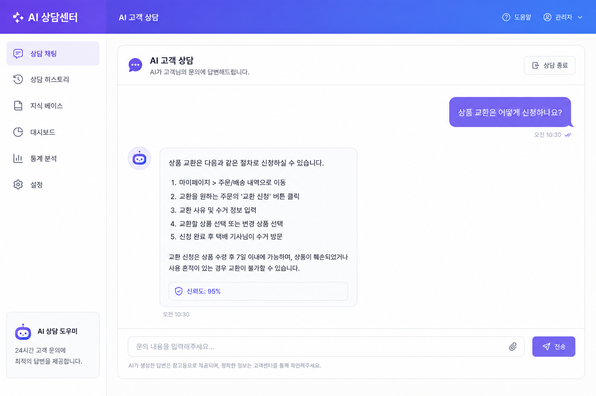
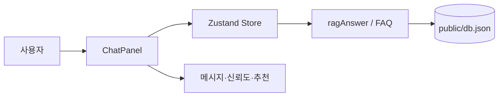

# AI 상담 · AI Chat

RAG(검색 증강 생성) 스타일 FAQ 매칭과 채팅 UI를 제공하는 React(Vite) 웹 앱입니다. 이 저장소는 [metaapple/ai-chat](https://github.com/metaapple/ai-chat)에 게시됩니다. <br>


## 스택 요약

| 구분 | 기술 |
| --- | --- |
| 프레임워크 | React 18, TypeScript, Vite 5 |
| UI | Tailwind CSS, shadcn/ui, Bootstrap 레이아웃 일부 |
| 상태 | Zustand (`consultationStore`) |
| 차트 | Recharts, react-google-charts |
| HTTP | Axios |

## 주요 기능

| 기능 | 설명 |
| --- | --- |
| AI 채팅 패널 | FAQ 벡터 검색에 가까운 `ragAnswer()` 기반 응답, 신뢰도 표시 |
| 메트릭·차트 | 상담 건수 등 대시보드 위젯 |
| FAQ 검색 | 공개 FAQ 데이터와 연동 가능한 검색 UI |

## 화면 캡처 (chat-1 · chat-2)

## 사용자 질문·봇 응답



## 데모 동영상 (MOV)

https://youtu.be/fHrHqrn27wE 

[

## 아키텍처 개요



## 코드 하이라이트: 메시지 전송과 RAG 응답

`ChatPanel`에서 입력을 보내고, 짧은 지연 후 `ragAnswer`로 봇 답을 붙이는 흐름입니다.

```tsx
const send = (text: string) => {
  const t = text.trim();
  if (!t) return;
  const userMsg: Msg = { id: Date.now(), role: "user", text: t };
  setMessages((m) => [...m, userMsg]);
  setInput("");
  setTyping(true);
  setTimeout(() => {
    const { faq, confidence } = ragAnswer(t);
    const reply: Msg = faq
      ? { id: Date.now() + 1, role: "bot", text: faq.answer, confidence }
      : { id: Date.now() + 1, role: "bot", text: "죄송합니다. 관련 답변을 찾지 못했어요. 1:1 상담사 연결을 도와드릴까요?", confidence: 0 };
    setMessages((m) => [...m, reply]);
    setTyping(false);
  }, 700);
};
```

## 로컬 실행

```bash
npm install
npm run dev
```

빌드:

```bash
npm run build
npm run preview
```

